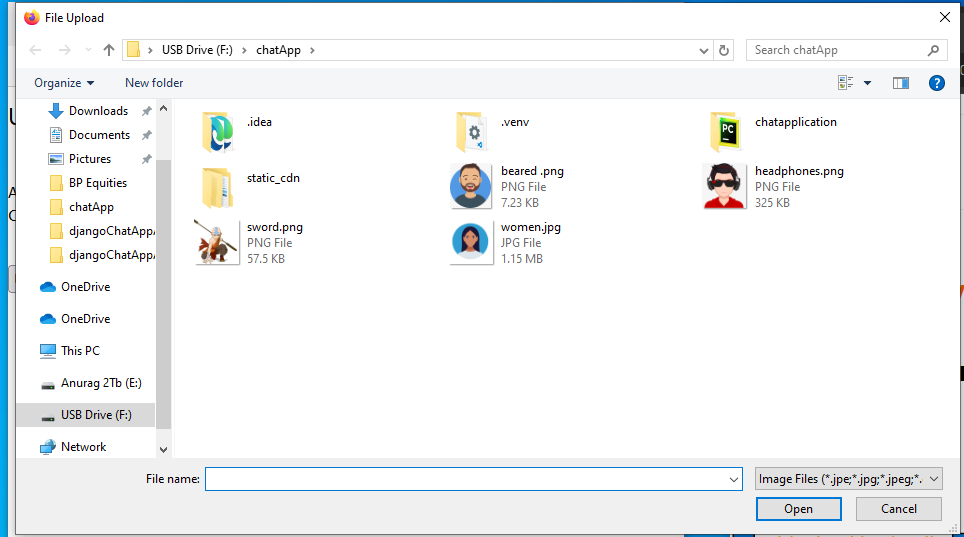

# MyChatApp

MyChatApp is a Django-based chat application that allows users to register, log in, view chats, and message each other within a single organization.

## Setup Instructions

### Prerequisites

- Python (version = 3.2)
- Pip (Python package installer)

### Installation

1. Navigate to the project directory:

    ```
    cd djangoChatAppAnurag\src
    ```

2. Install dependencies:

    ```
    pip install -r requirements.txt
    ```

### Project Initialization

3. Start the development server:

    ```
    python manage.py runserver
    ```

Now you can access your Django project at http://127.0.0.1:8000/.


### Project Endpoints

4. To Register a user:

    ```
    http://127.0.0.1:8000/register
    ```
- Enter the Email, Username, Password and Confirm Password
- Then click Submit


5. To Login a user:

    ```
    http://127.0.0.1:8000/api_auth/login
    ```
- Enter the Username and Password
- Then click Log in


6. Post Login:

    ```
    http://127.0.0.1:8000/home
    ```
- Here we can see the basic details of the user.
- Like, 
  - how many unread chats.
  - The Avatar.
  - A button to upload or modify the avatar.
  - A button to logout from the account.
  - A link to add friends from a chat list.


7. Click on the Add Friend in chat list:

    ```
    http://127.0.0.1:8000/create_friend/
    ```
- Here we can see the a list of user, with whom we can connect and chat.
- Like, 
  - Just click on the list of users.
  - It automatically gets added to your list of friends.
  - Once you click on any listed user it gets added to your friends list.


  
8. Click on the Upload Avatar:

    ```
    http://127.0.0.1:8000/profileUpdate/
    ```
- Here we can see that we get a button to browse our favorite image to be uploaded as an avatar.
- Like, 
  - Just click on the button Browse.
  - It automatically takes you to files and folders of your local computer to select an avatar from.
  - Click on Update Profile Avatar.
  - It takes you to the home page of your account with updated avatar.
  - 
  - 
  - 
  - 
  
9. Click on the My Chat List:

    ```
    http://127.0.0.1:8000/profileUpdate/
    ```
- Here we can see that we a list of friends whom we have added to our friends list.
- Just click any one and you can start chatting with them, only if they are online. 
- if they are not online, once they login they will see number of unread mesages.
- Also they can see who has send them messages and how many are unread,
- If you both are online and are actively chatting then you can also see Typing... when the other user is typing.
- Same the other user sees when you are typing.
- You can also see the send and received tick marks getting highlighted once the other user reads your messages.
- 
- 